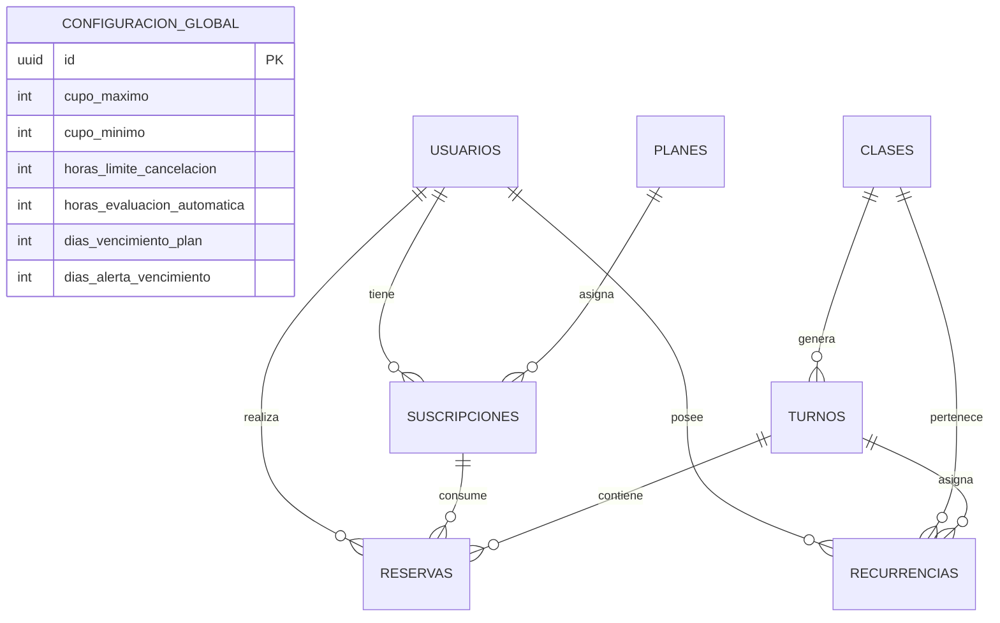

# 🗄️ Arquitectura y Esquema de Base de Datos — FireSeed
## Proyecto: Aplicación de Reservas y Gestión para Estudio de Pilates

/* Developed by FireSeed - Fueling Innovation */

---

## 1. Diagrama Entidad-Relación (ERD)

---

## 2. Diccionario de Datos (Estructura de Tablas)

### 2.1 Tabla: `configuracion_global`
Almacena los parámetros operativos del estudio. Es una tabla de fila única editada únicamente por el administrador.

| Campo | Tipo de Dato | Restricciones / Index | Descripción |
| :--- | :--- | :--- | :--- |
| `id` | UUID | PK, Default: `uuid_generate_v4()` | Identificador único. |
| `cupo_maximo_defecto` | Integer | NOT NULL, Check: `> 0`, Default: `3` | Límite máximo de alumnos por clase. |
| `cupo_minimo_defecto` | Integer | NOT NULL, Check: `> 0`, Default: `2` | Mínimo de alumnos para no cancelar la clase. |
| `horas_limite_cancelacion` | Integer | NOT NULL, Default: `24` | Horas previas requeridas para cancelar sin penalización. |
| `horas_evaluacion_automatica` | Integer | NOT NULL, Default: `25` | Horas previas donde corre el chequeo de cierre/alerta. |
| `dias_vencimiento_plan` | Integer | NOT NULL, Default: `30` | Duración estándar de los planes. |
| `dias_alerta_vencimiento` | Integer | NOT NULL, Default: `5` | Días previos al vencimiento para notificar al alumno. |
| `updated_at` | DateTime | NOT NULL, Auto-update | Fecha de última modificación. |

---

### 2.2 Tabla: `usuarios`
Maneja la autenticación y perfiles de clientes y administradores.

| Campo | Tipo de Dato | Restricciones / Index | Descripción |
| :--- | :--- | :--- | :--- |
| `id` | UUID | PK, Default: `uuid_generate_v4()` | Identificador único. |
| `nombre` | Varchar(100) | NOT NULL | Nombre del usuario. |
| `apellido` | Varchar(100) | NOT NULL | Apellido del usuario. |
| `email` | Varchar(255) | UNIQUE, INDEX, NOT NULL | Correo electrónico principal. |
| `telefono` | Varchar(30) | NULLABLE | Número de WhatsApp (ej. `+54911...`). |
| `google_id` | Varchar(255) | UNIQUE, NULLABLE, INDEX | ID de autenticación de Google OAuth. |
| `rol` | Enum | NOT NULL, Default: `'CLIENTE'` | Valores: `'CLIENTE'`, `'ADMIN'`. |
| `is_active` | Boolean | NOT NULL, Default: `True` | Estado lógico del usuario (Soft Delete). |
| `created_at` | DateTime | NOT NULL, Auto-now-add | Fecha de registro. |

---

### 2.3 Tabla: `planes`
Catálogo de membresías o paquetes de clases ofrecidos por el estudio.

| Campo | Tipo de Dato | Restricciones / Index | Descripción |
| :--- | :--- | :--- | :--- |
| `id` | UUID | PK, Default: `uuid_generate_v4()` | Identificador único. |
| `nombre` | Varchar(100) | NOT NULL | Nombre del plan (ej. *Paso Fijo 8 Clases*). |
| `cantidad_clases` | Integer | NOT NULL, Check: `> 0` | Número de clases incluidas en el paquete. |
| `precio` | Decimal(10,2) | NOT NULL, Check: `>= 0` | Costo del plan. |
| `is_active` | Boolean | NOT NULL, Default: `True` | Disponibilidad comercial del plan. |

---

### 2.4 Tabla: `suscripciones` (Planes Activos del Cliente)
Gestiona los créditos, vigencia y saldos de cada alumno.

| Campo | Tipo de Dato | Restricciones / Index | Descripción |
| :--- | :--- | :--- | :--- |
| `id` | UUID | PK, Default: `uuid_generate_v4()` | Identificador único. |
| `usuario_id` | FK(usuarios.id) | NOT NULL, INDEX | Alumno propietario de la suscripción. |
| `plan_id` | FK(planes.id) | NOT NULL | Plan base adquirido. |
| `clases_restantes` | Integer | NOT NULL, Check: `>= 0` | Saldo actual de créditos disponibles. |
| `fecha_inicio` | Date | NOT NULL | Fecha de activación del plan. |
| `fecha_vencimiento` | Date | NOT NULL, INDEX | Fecha de expiración (Inicio + 30 días). |
| `estado` | Enum | NOT NULL, Default: `'ACTIVO'`, INDEX | Valores: `'ACTIVO'`, `'AGOTADO'`, `'VENCIDO'`. |

---

### 2.5 Tabla: `clases` (Plantillas de Tipos de Clase)

| Campo | Tipo de Dato | Restricciones / Index | Descripción |
| :--- | :--- | :--- | :--- |
| `id` | UUID | PK, Default: `uuid_generate_v4()` | Identificador único. |
| `nombre` | Varchar(100) | NOT NULL | Nombre (ej. *Pilates Reformer*, *Mat*). |
| `descripcion` | Text | NULLABLE | Detalles del nivel o enfoque de la clase. |
| `duracion_minutos`| Integer | NOT NULL, Default: `60` | Duración en minutos. |
| `cupo_maximo` | Integer | NOT NULL, Check: `> 0` | Capacidad máxima física del salón. |
| `cupo_minimo` | Integer | NOT NULL, Check: `> 0` | Mínimo requerido de alumnos. |
| `is_active` | Boolean | NOT NULL, Default: `True` | Estado operacional. |

---

### 2.6 Tabla: `turnos` (Instancias de Agenda / Clases Programadas)
Instancias concretas en el calendario (días y horas específicos).

| Campo | Tipo de Dato | Restricciones / Index | Descripción |
| :--- | :--- | :--- | :--- |
| `id` | UUID | PK, Default: `uuid_generate_v4()` | Identificador único del turno. |
| `clase_id` | FK(clases.id) | NOT NULL | Tipo de clase que se dicta. |
| `fecha` | Date | NOT NULL, INDEX | Fecha de la sesión. |
| `hora_inicio` | Time | NOT NULL, INDEX | Hora de comienzo. |
| `hora_fin` | Time | NOT NULL | Hora de finalización. |
| `cupo_actual` | Integer | NOT NULL, Check: `>= 0` | Cantidad actual de alumnos inscriptos. |
| `estado` | Enum | NOT NULL, Default: `'PROGRAMADO'`, INDEX| Valores: `'PROGRAMADO'`, `'CONFIRMADO'`, `'CANCELADO'`, `'COMPLETADO'`. |
| `evaluado_25hs` | Boolean | NOT NULL, Default: `False`, INDEX | Flag para asegurar que el Cron Job corrió a las 25hs. |

* **Constraint Única:** `UniqueConstraint(fecha, hora_inicio, clase_id)` (Evita duplicar el mismo turno en el mismo horario).
* **Constraint Check:** `CheckConstraint(cupo_actual <= cupo_maximo)` (Previene sobreventa de cupos).

---

### 2.7 Tabla: `recurrencias` (Bloqueo Fijo de Horario)
Mapea la reserva automática y fija de un alumno para un día y hora semanal recurrente.

| Campo | Tipo de Dato | Restricciones / Index | Descripción |
| :--- | :--- | :--- | :--- |
| `id` | UUID | PK, Default: `uuid_generate_v4()` | Identificador único. |
| `usuario_id` | FK(usuarios.id) | NOT NULL, INDEX | Alumno dueño del horario fijo. |
| `clase_id` | FK(clases.id) | NOT NULL | Tipo de clase reservada. |
| `dia_semana` | Integer | NOT NULL, Check: `1 TO 7` | Día de la semana (1 = Lunes, 7 = Domingo). |
| `hora_inicio` | Time | NOT NULL | Hora fija del turno. |
| `is_active` | Boolean | NOT NULL, Default: `True` | Mantiene el cupo protegido mientras renueve el plan. |

* **Constraint Única:** `UniqueConstraint(clase_id, dia_semana, hora_inicio, usuario_id)`.

---

### 2.8 Tabla: `reservas` (Inscripciones a Turnos)
Registro puntual de la asistencia/reserva de un alumno a un turno específico.

| Campo | Tipo de Dato | Restricciones / Index | Descripción |
| :--- | :--- | :--- | :--- |
| `id` | UUID | PK, Default: `uuid_generate_v4()` | Identificador único de la reserva. |
| `turno_id` | FK(turnos.id) | NOT NULL, INDEX | Turno específico al que asiste. |
| `usuario_id` | FK(usuarios.id) | NOT NULL, INDEX | Alumno inscripto. |
| `suscripcion_id`| FK(suscripciones.id)| NOT NULL | Plan que cubre la reserva. |
| `es_recurrente` | Boolean | NOT NULL, Default: `False` | Indica si proviene de una regla fija. |
| `estado` | Enum | NOT NULL, Default: `'CONFIRMADA'`, INDEX| Valores: `'CONFIRMADA'`, `'CANCELADA_TIEMPO'`, `'CANCELADA_TARDIA'`, `'TOMADA'`. |
| `created_at` | DateTime | NOT NULL, Auto-now-add | Fecha exacta en que se realizó la reserva. |

* **Constraint Única:** `UniqueConstraint(turno_id, usuario_id)` (Un alumno solo puede anotarse una vez por turno).

---

## 3. Índices Estratégicos para Rendimiento

1. `idx_turnos_fecha_hora`: Optimiza la búsqueda del calendario en el frontend (`turnos.fecha`, `turnos.hora_inicio`).
2. `idx_turnos_evaluacion`: Acelera el Cron Job de las 25hs filtrando `evaluado_25hs = False` y `fecha` / `hora_inicio`.
3. `idx_suscripciones_vencimiento`: Acelera el proceso de alertas de vencimiento de planes.
4. `idx_reservas_usuario_estado`: Optimiza la consulta del Dashboard del Cliente para mostrar "Mis Próximas Clases".
